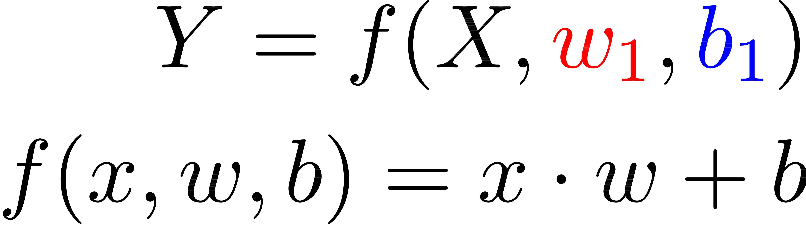
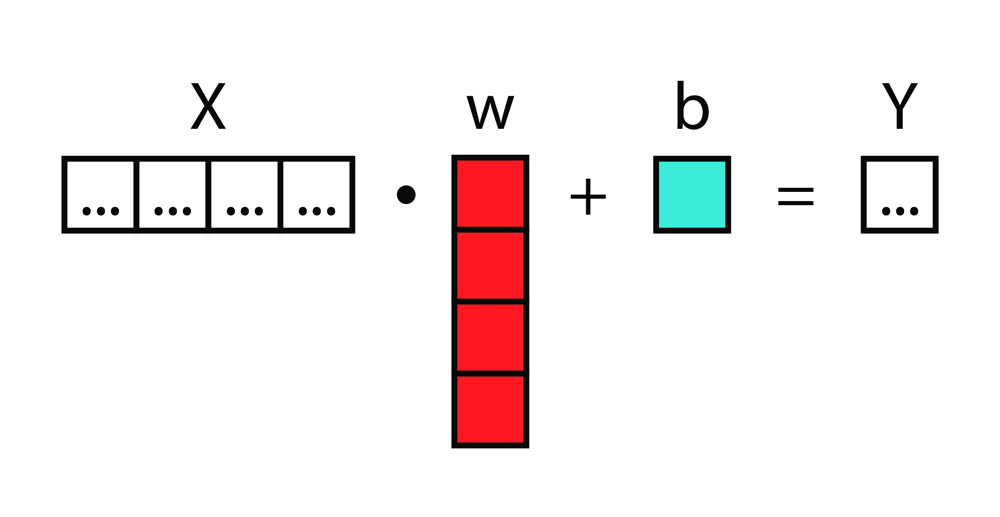
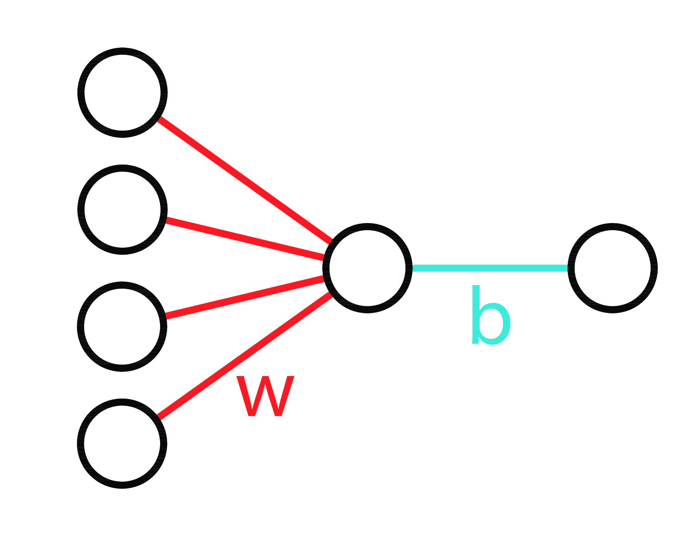
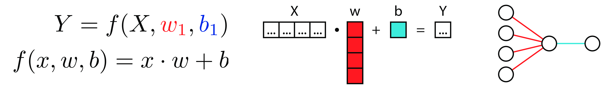
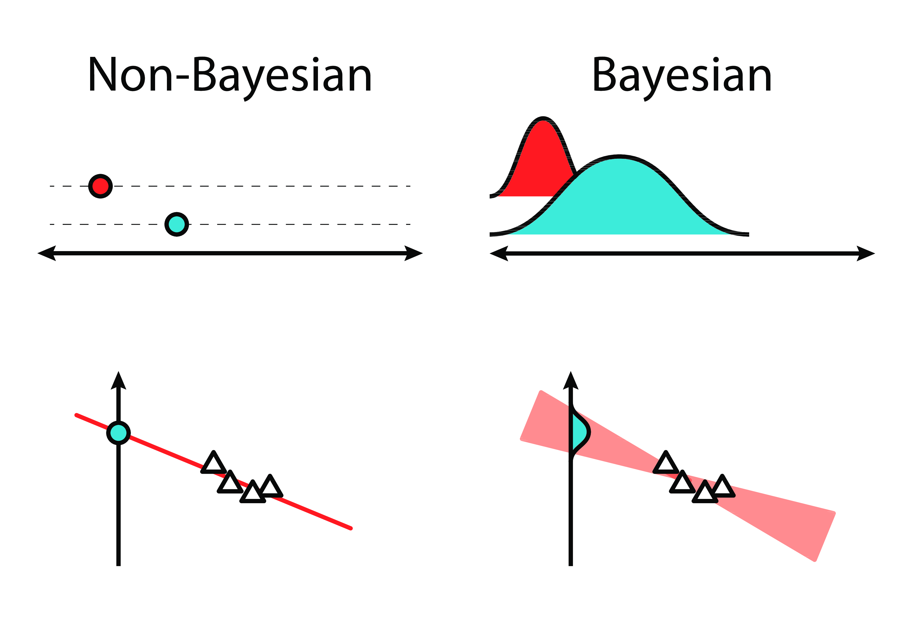

# Fret Not, It's Curve Fitting All The Way Down!

 <!-- .element width="20%" align="left" -->

Eric J. Ma, Digility 2018 <!-- .element align="right" -->

Scan QR Code to save my contact info. <!-- .element align="right" -->
---

# Follow Along!

[https://ericmjl.github.io/**curve-fitting-talk**](https://ericmjl.github.io/curve-fitting-talk)

 <!-- .element width="30%" -->

Scan this QR code to bookmark these slides!

---

# About Myself

- Investigator, Scientific Data Analysis, NIBR <!-- .element: class="fragment" -->
- MIT Biological Engineering, ScD, 2017 <!-- .element: class="fragment" -->
- Self-taught machine & deep learner, Bayesian statistics, programming <!-- .element: class="fragment" -->

---

# Goals

1. Demystify Bayesian statistical inference. <!-- .element: class="fragment" -->
1. Illustrate a simple framework for thinking through Bayesian models. <!-- .element: class="fragment" -->

----

# Agenda

1. Bayes' rule. <!-- .element: class="fragment" -->
1. Bayesian estimation. <!-- .element: class="fragment" -->
1. Bayesian linear regression. <!-- .element: class="fragment" -->
1. Bayesian logistic regression. <!-- .element: class="fragment" -->
1. Bayesian deep learning. <!-- .element: class="fragment" -->

---

<!-- .slide: data-background="./images/bayes-rule-neon-sign.jpg" -->

---

# Bayesian estimation

---

# Linear regression

----

## Functional form

 <!-- .element border="none" -->

----

## Matrices

 <!-- .element border=none  -->

----

## Neural

 <!-- .element height="50%" width="50%" border=none -->

----

## Linear Regression 3 Ways

----

## Bayesian Linear Regression

 <!-- .element width="80%" class="fragment" -->

---

# Logistic regression

---

# Deep learning

---

# Hierarchical models

---

# Flowchart

1. Describe your data according to some probability distribution. <!-- .element: class="fragment" -->
1. Are you comparing multiple groups? <!-- .element: class="fragment" -->
1. Do you have multiple "predictor" variables to predict your outputs? <!-- .element: class="fragment" -->
1. Do you know the math function that "links" your inputs to your outputs? <!-- .element: class="fragment" -->

---

# Example: Data Science Storytelling

<!-- Core idea: we have darwin's finches, use Bayesian hierarchical modelling to write a model that estimates Finch beak dimensions (both wing and beak), and then use QR codes to display this information. -->
