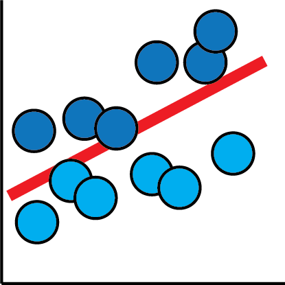
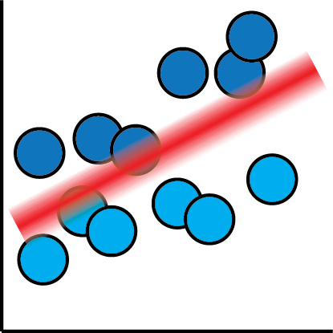
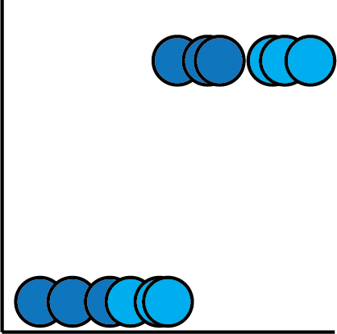
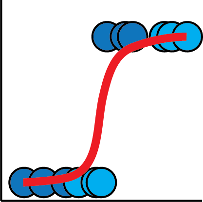
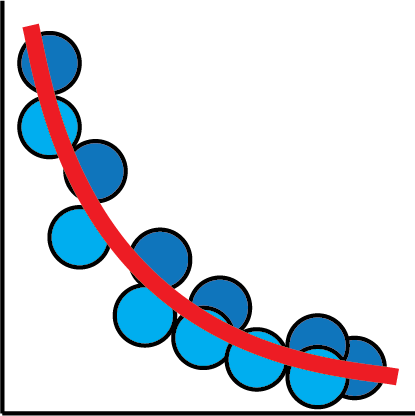
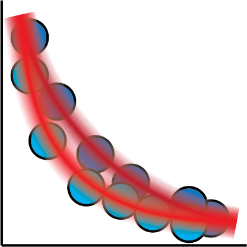
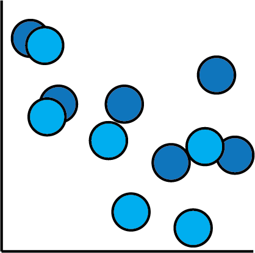
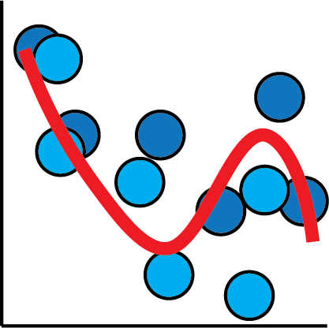
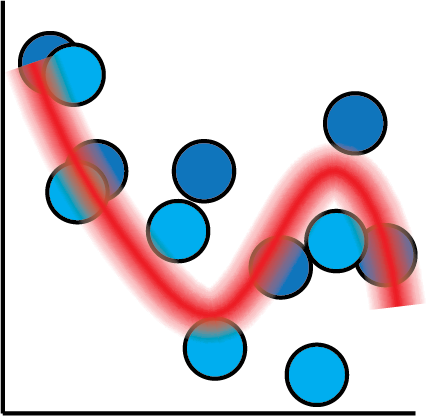
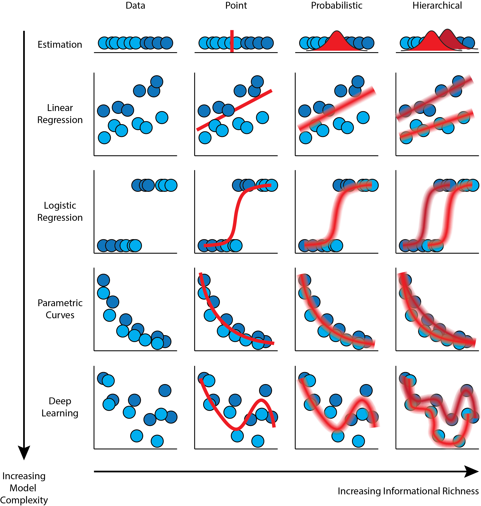

# Fret Not, It's Curve Fitting All The Way Down!

 <!-- .element width="250px" align="left" -->

*a.k.a. a crash course in Bayesian statistical modelling* <!-- .element align="right" -->

Scan QR Code to save my contact info. <!-- .element align="right" -->

---

# Follow Along!

[https://ericmjl.github.io/**curve-fitting-talk**](https://ericmjl.github.io/curve-fitting-talk)

 <!-- .element width="250px" -->

Scan QR code to bookmark slides!

---

# About Myself

- Investigator, Scientific Data Analysis, NIBR <!-- .element: class="fragment" -->
- MIT Biological Engineering, ScD, 2017 <!-- .element: class="fragment" -->
- Self-taught machine & deep learner, Bayesian Pythonista <!-- .element: class="fragment" -->

---

# Goals

1. Demystify Bayesian statistical inference. <!-- .element: class="fragment" -->
1. Illustrate the link between Bayesian statistics and deep learning<!-- .element: class="fragment" -->

----

# Agenda

1. Bayes' rule. <!-- .element: class="fragment" -->
1. Bayesian estimation. <!-- .element: class="fragment" -->
1. Bayesian linear regression. <!-- .element: class="fragment" -->
1. Bayesian logistic regression. <!-- .element: class="fragment" -->
1. Arbitrary Bayesian curve fitting. <!-- .element: class="fragment" -->

---

<!-- .slide: data-background="images/bayes-rule-neon-sign.jpg" -->

---

## Estimation

 <!-- .element width="20%" class="fragment"-->
 <!-- .element width="20%"  class="fragment"-->
 <!-- .element width="20%"  class="fragment"-->
 <!-- .element width="20%"  class="fragment"-->

----

## Linear regression

 <!-- .element width="20%" class="fragment"-->
 <!-- .element width="20%"  class="fragment"-->
 <!-- .element width="20%"  class="fragment"-->
 <!-- .element width="20%"  class="fragment"-->

----

## Logistic regression

 <!-- .element width="20%" class="fragment"-->
 <!-- .element width="20%"  class="fragment"-->
 <!-- .element width="20%"  class="fragment"-->
 <!-- .element width="20%"  class="fragment"-->

----

## Parametric Curves

 <!-- .element width="20%" class="fragment"-->
 <!-- .element width="20%"  class="fragment"-->
 <!-- .element width="20%"  class="fragment"-->
 <!-- .element width="20%"  class="fragment"-->

----

## Neural Networks

 <!-- .element width="20%" class="fragment"-->
 <!-- .element width="20%"  class="fragment"-->
 <!-- .element width="20%"  class="fragment"-->
 <!-- .element width="20%"  class="fragment"-->

----

 <!-- .element width="63%"-->

---

# Example: Darwin's Finches

<!-- Core idea: we have darwin's finches, use Bayesian hierarchical modelling to write a model that estimates Finch beak dimensions (both wing and beak), and then use QR codes to display this information. -->

---

